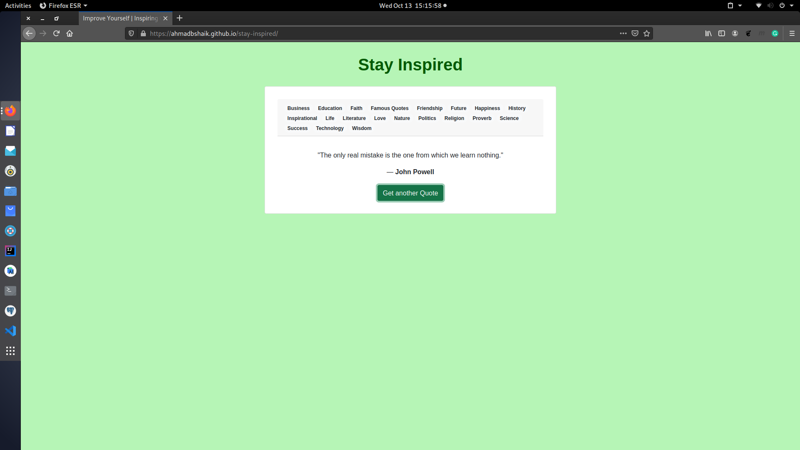
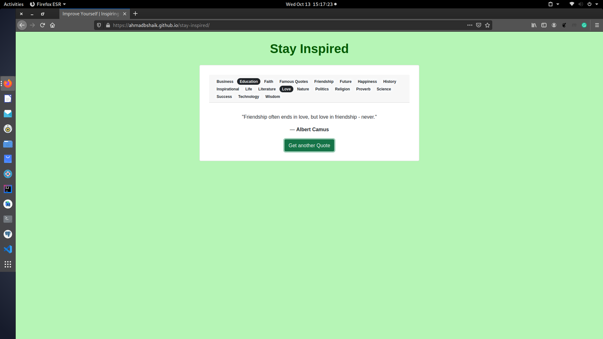
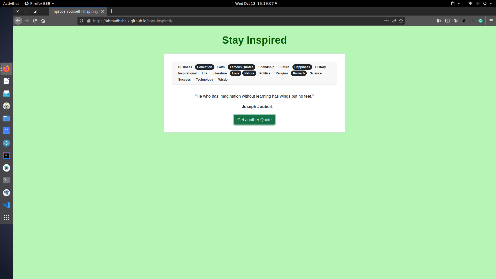

# StayInspired

It pulls data from [external api](https://api.quotable.io)

It displays random quotation by default

These quotes can be filtered by tags using badges

click [here](https://ahmadbshaik.github.io/stay-inspired) for live demo